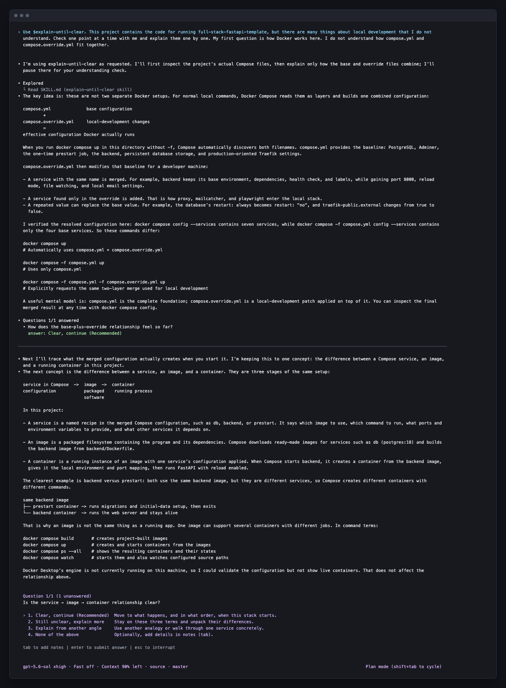

# Explain Until Clear

A Codex and Claude Code Skill for learning difficult subjects interactively. It checks the
available material, explains one concept at a time, and lets the user choose whether to continue
or hear the current concept another way. It works for code, systems, papers, mathematics,
products, business topics, and other unfamiliar domains.

## Recommended: use Plan mode

For a longer learning session, enable **Plan mode** in Codex before invoking the Skill. Plan mode
keeps the session focused on read-only investigation, questions, and explanation instead of
premature implementation. The Skill also works in the default mode.

## How it works

1. Inspect the relevant material before explaining.
2. If the user asked a specific question, answer it directly without an intake questionnaire.
3. Explain one relevant concept, then ask the user to choose one short status:
   `Clear, continue`, `Still unclear, explain more`, or `Explain from another angle`.
4. Let the user optionally add a short note naming the unclear point.
5. Continue to the next concept when the user is clear; otherwise, explain the current concept
   differently.

The check is a self-reported status, not a test. The user never has to restate the explanation,
prove understanding, take a quiz, or write a long reply.

## Demo



This vertically cropped transcript comes from a real Codex CLI Plan-mode session in the public
[`fastapi/full-stack-fastapi-template`](https://github.com/fastapi/full-stack-fastapi-template)
repository at commit
[`d506ea4883c0f7bfcf5280921cfc407c46808711`](https://github.com/fastapi/full-stack-fastapi-template/commit/d506ea4883c0f7bfcf5280921cfc407c46808711).
It shows the user choosing an existing status option and Codex moving to one next concept without
requesting a written response.

## Install

Clone the repository directly into a host's Skill directory. The repository root is the Skill
root and contains `SKILL.md`:

```bash
git clone git@github.com:zzzhr97/explain-until-clear.git \
  ~/.codex/skills/explain-until-clear
```

For Claude Code, use `~/.claude/skills/explain-until-clear` instead. Start a new session after
installation so the host discovers the Skill.

## Use

```text
Use $explain-until-clear. I want to understand how this project's Docker setup works.
Inspect the relevant sources first, then explain one concept at a time and let me choose whether
to continue or hear it another way.
```

You can also invoke the Skill for non-code topics:

```text
Use $explain-until-clear to help me understand statistical significance. Explain one concept at a
time and let me choose whether to continue or hear the current concept another way.
```
