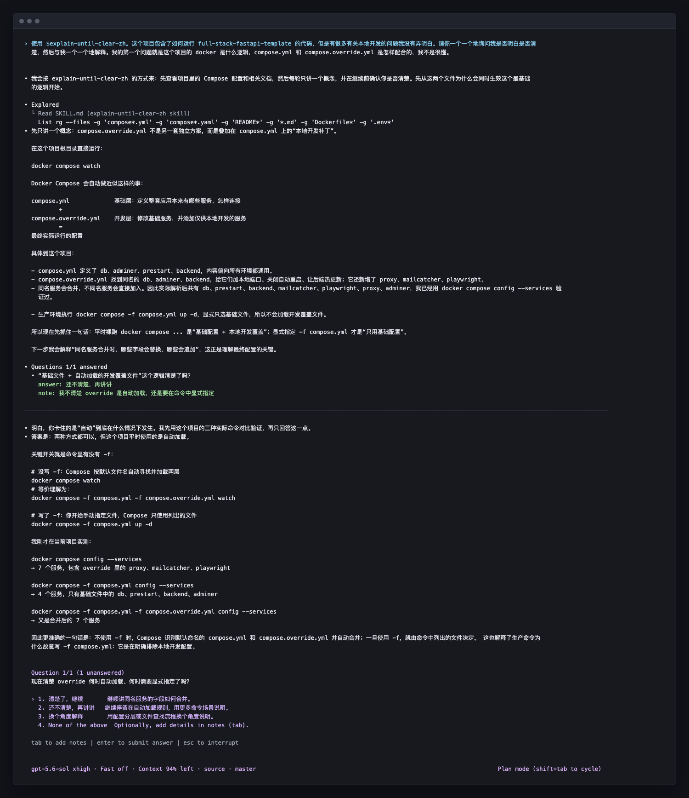

# Explain Until Clear

[English](README.md)

这是一个双语 Codex Skill，用于通过互动逐步弄懂复杂或陌生的主题。它会先查看现有材料，每次只解释
一个概念，再让用户选择继续还是换一种方式重讲当前概念。它不仅适用于代码，也适用于系统、论文、
数学、产品、商业以及其他领域。

## 推荐开启 Plan 模式

开始较长的学习会话前，推荐先在 Codex 中开启 **Plan 模式**。Plan 模式有利于把会话保持在只读调查、
提问和解释上，避免过早进入实现。没有开启 Plan 模式时，这个 Skill 也可以正常使用。

## 工作方式

1. 先查看相关材料，再开始解释。
2. 用户已经提出具体问题时，直接回答，不先做问卷。
3. 每次只解释一个相关概念，然后请用户选择一个简短状态：`清楚了，继续`、
   `还不清楚，再讲讲`或`换个角度解释`。
4. 用户可以补充一句具体没听懂的地方，也可以只点选状态。
5. 用户选择清楚后进入下一个概念；选择不清楚后，换一种方式重讲当前概念。

理解检查只是用户自报状态，不是考试。用户不需要复述讲解、证明自己已经理解、做题或回复一大段话。

## 演示



这张纵向裁剪的会话截图来自一次真实的 Codex CLI Plan 模式会话。演示材料是公开仓库
[`fastapi/full-stack-fastapi-template`](https://github.com/fastapi/full-stack-fastapi-template)，
固定在提交
[`d506ea4883c0f7bfcf5280921cfc407c46808711`](https://github.com/fastapi/full-stack-fastapi-template/commit/d506ea4883c0f7bfcf5280921cfc407c46808711)。
截图展示了用户通过补充文字指出局部疑问，Codex 针对这一点重新解释，并再次给出三个状态选项。

## 安装

克隆本仓库，然后安装任意一种语言版本，也可以同时安装：

```bash
mkdir -p ~/.codex/skills
cp -R explain-until-clear ~/.codex/skills/
cp -R explain-until-clear-zh ~/.codex/skills/
```

安装后新建一个 Codex 会话，使 Codex 重新发现这些 Skill。

## 使用

中文版：

```text
使用 $explain-until-clear-zh。我想弄懂这个项目的 Docker 是什么逻辑。请先查看相关材料，
每次只解释一个概念，再让我选择继续还是换一种讲法。
```

英文版：

```text
Use $explain-until-clear. I want to understand how this project's Docker setup works.
Inspect the relevant sources first, then explain one concept at a time and let me choose whether
to continue or hear it another way.
```

这个 Skill 同样适用于非代码主题：

```text
使用 $explain-until-clear-zh 帮我弄懂统计显著性。每次只解释一个概念，再让我选择继续还是换一种
方式重讲当前概念。
```
